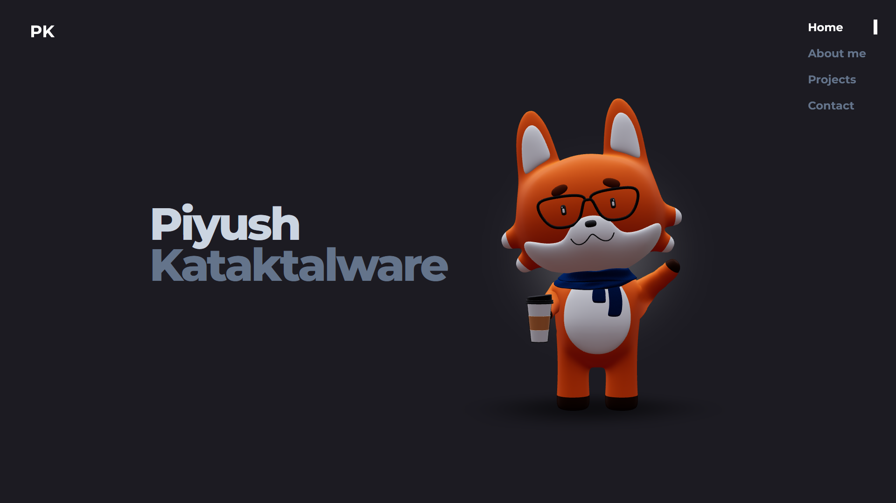
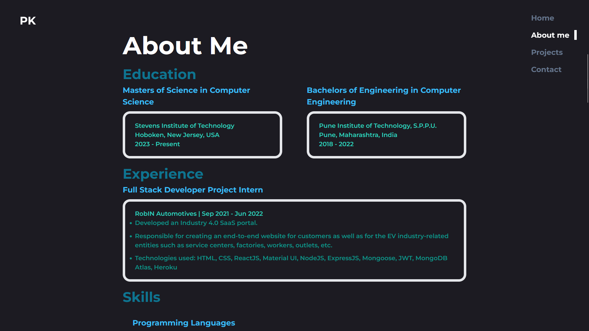
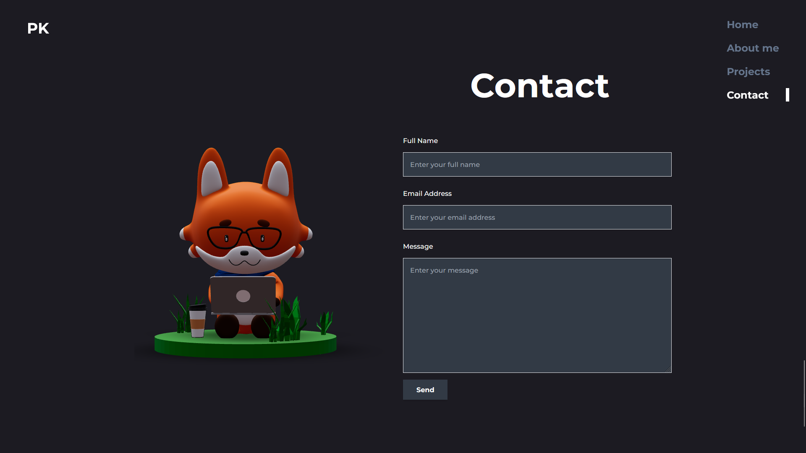

# 3D Portfolio Website

Welcome to my 3D Portfolio Website! This project showcases my development and design skills through an interactive, animated, and responsive personal site.

Inspired by game character selection screens, the landing page features a rotating 3D interface where each "character" or element represents a section of the portfolio. This creative concept is aimed at making personal portfolios more engaging and visually memorable.

## 🌐 Live Demo

🔗 [View Website](https://piyushk-t.github.io/3d-portfolio-website/)

## 🚀 Features

- 🌀 3D animated hero section
- 🎨 Smooth transitions using Framer Motion
- 📱 Fully responsive layout
- ⚡ Blazing fast builds with Vite
- 📁 Projects, Skills, About Me, and Contact sections
- 🌙 Dark UI with modern aesthetics

## 📸 Screenshots





## 🧰 Tech Stack

- **React** – Frontend framework
- **Tailwind CSS** – Utility-first CSS framework
- **Framer Motion** – Animations
- **React Three Fiber** – 3D rendering
- **Vite** – Lightning-fast development server and bundler

## 📁 Folder Structure

```
3d-portfolio-website/
├── public/
│   └── index.html
├── src/
│   ├── assets/
│   ├── components/
│   ├── pages/
│   ├── App.jsx
│   └── main.jsx
├── .eslintrc.cjs
├── .gitignore
├── package.json
├── postcss.config.js
├── tailwind.config.js
└── vite.config.js
```

## 📦 Installation

To run this project locally, follow these steps:

1. Clone the repository:

   ```bash
   git clone https://github.com/PiyushK-T/3d-portfolio-website.git
   ```

2. Navigate to the project directory:

   ```bash
   cd 3d-portfolio-website
   ```

3. Install dependencies:

   ```bash
   npm install
   ```

4. Start the development server:

   ```bash
   npm run dev
   ```

   The application will be available at [http://localhost:5173](http://localhost:5173)

## 🙏 Credits

This project is heavily inspired by the  
🎥 [3D Parallax Developer Portfolio Website](https://github.com/ForrestKnight/3d-portfolio) by [ForrestKnight](https://github.com/ForrestKnight),  
featured in the [I Built a 3D Developer Portfolio Website // Three.js + React + Tailwind](https://www.youtube.com/watch?v=f_ZxgQQ74Lc) tutorial.  

Portions of the layout, animation logic, and component structure are based on his original work, which is licensed under the MIT License.

## 📄 License

This project is licensed under the **MIT License**.  
See the [LICENSE](./LICENSE) file for more details.
